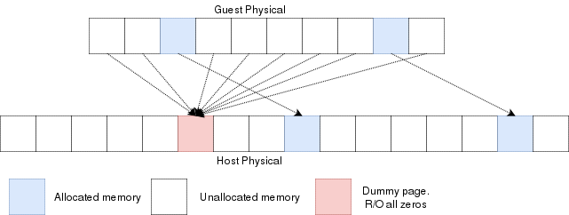
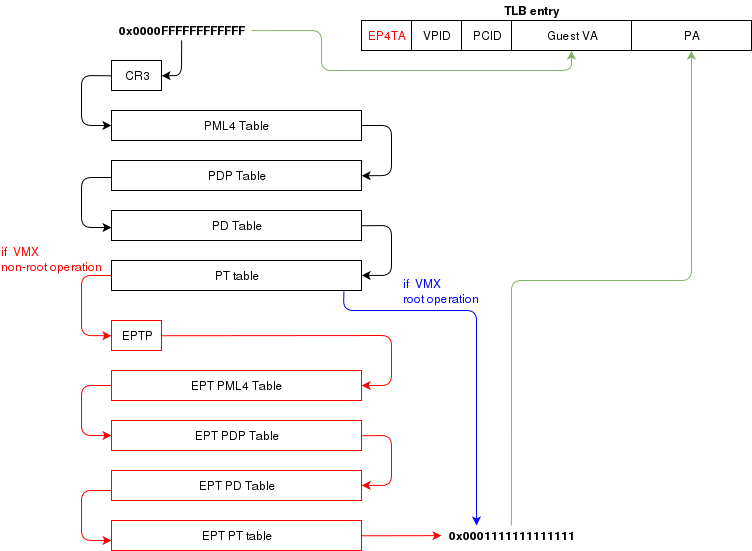
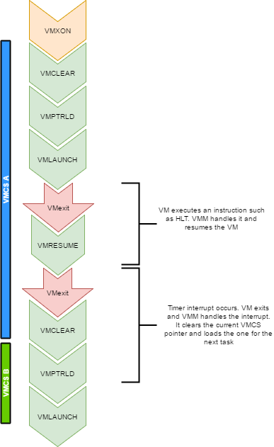

WRITING A HYPERVISOR WITH INTEL VT-X
====================================

2017-06-21
----------

Introduction
------------

Before virtualization support was available on CPUs, virtual machines
were emulating most of the code that a guest OS would run. With VMX, the
CPU handles the virtualization. If you are familiar with the hardware
context-switches that were available on ia32, it's a bit similar. The
hypervisor manages many VMs. When executing code of a VM, there is a
hardware context switch that occurs. The context switch saves the
current CPU state (but not the general purpose registers) and loads
another state that would be the one of the VM. Then code can execute
from there. So the VM ends up running "bare-metal". The CPU has changed
it's entire context and runs your VM just as it would if the guest was
running bare-metal. With one exception: Some operations causes VMExits.
For example, when an interrupt occurs, the CPU automatically switches
back to the hypervisor context (what they call the VMM). The VMM can
then handle the interrupt and change the Guest's state data so that on
the next entry it will think it has an interrupt to handle (or not).
This is basically how you would handle the timer interrupt on the guest
and on the host so that multithreading works. VMExits occur for many
other reasons. You could have a VMExit occur when the VM tries to access
unmapped memory, when executing "hlt" or many other reasons.

To view the full source code of my OS:
<https://github.com/pdumais/OperatingSystem>

Goal
----

The virtual environment we'll be setting up is for a 16bit real mode VM
because that's how a real CPU would start. Control will initially be
transfered to address 0x00000000. Normally, an entry point to BIOS code
should be located there and then the BIOS would eventually load the
first sector of the primary HDD and transfer control to 0x7c00. But in
my case, I am not writting a BIOS, so only test code will be executed in
the VM.

Memory
------

In a VMX environment, there exists several layers of memory:

-   Guest virtual memory: The guest's virtual memory if paging is
    enabled in the Guest. That memory translates to guest physical
    memory using the guest's paging structures, entirely controlled by
    the guest.
-   Guest physical memory: This is the physical memory from the VM's
    point of view. From the hypervisor's point of view, this is just
    virtual memory that has to be mapped to physical memory. This memory
    would be allocated lazily as the VM uses more and more memory. This
    memory is mapped to physical memory by the hypervisor.
-   Physical memory: This is the real hardware physical memory as seen
    by the host's CPU.

For the VM to have memory, some of the host's physical memory must be
assigned to the VM. The guest's physical memory is seen as virtual
memory by the host. To assign memory to the guest, a feature provided by
the CPU called "EPT" can be used. EPT works Just like the regular paging
system. It is a way to map guest-physical addresses to real physical
addresses using a paging structure with a PML4 table on top.

So a guest would prepare it's own internal paging system and have it's
own PML4 table. When an a virtual address inside the VM needs to be
resolved, it will be resolved to the guest's physical address using its
PML4 table. Then, the guest-physical address will be resolved using the
EPT's PML4 table. So 2 translations would be done.

EPT is enabled by setting the "Enable EPT" bit in the VM-Execution
controls. When enabled, an EPT PML4 structure must be prepared and and
the base address of that structure must be stored in the VMCS EPT
pointer

### Lazy allocation of guest physical memory

When a guest is launched with, for example, 16gb of ram, it would not be
desirable to reserve that entire memory on the hypervisor immediately.
Instead, it would be preferable to allocate that memory in a lazy
allocation fashion. A guest might never use it's entire RAM so reserving
it on the hypervisor would be a waste.

Reading an unallocated guest physical page will return zeros. Writing to
it will trigger a EPT violation. The VMM can then reserve a physical
page and map it there instead of the dummy page.

When the guest is launched, a single page of write-protected physical
memory (filled with zeros) should be mapped to all the guest physical
memory. If the VM's BIOS starts probing memory by reading all of it,
every 4k would be mapped to that single page so the BIOS would read
zeros and think it is reading valid memory. If the BIOS (or the guest
OS) writes into memory, a VMexit would occur because writing to any
address would map to this write-protected physical page. The hypervisor
can then allocate a new R/W page to the EPT's paging structure for the
guest physical memory. Of course, if the guest does a write/read-back
kind of algorithm the probe the memory, then all the guest physical
memory will have been allocated because all pages will have been written
to, so all bets are off.

Reclaiming freed-up memory is a different story. The only way the
hypervisor can know about memory that can be reclaimed is by using
memory balooning. The virtio specification describes a memory baloon
device that can be implemented for that purpose.

When the guest will access guest-physical memory that is unmapped to
physical memory, a VMExit will occur. The hypervisor needs to evaluate
if the guest-physical address falls into the possible addressing space
of the VM (i.e. if it is trying to access memory beyond the last byte of
the virtual RAM). If the memory is unmapped because of the lazy-loading
scheme, then a new page can be allocated. If it is because that memory
address should not be mapped, then an exception will be injected back in
the VM and the guest will need to handle that.

### Translation Lookaside Buffer (TLB)

When the process translate a virtual address to a physical address, the
translation is cached in the TLB so that it wont have to walk through
the page tables again next time. In a virtual environment, the CPU only
has one TLB in which is caches translations for:

-   All host virtual/physical mappings
-   All guest-physical/physical mappings (of all VMs)
-   All guest-virtual/guest-physical mappings (of all VMs).

This could create collisions in the TLB. For example, 2 VMs could have a
mapping of virtual address 0x00000000. A simpler case would be two
processes with different virtual memory mappings running on the host.
For this reason, as I described in another article ([Process Context ID
and the TLB](index.php?article=ff3b7adb128cb438ac1e306b3fbe37e7)), the
TLB supports processID-tagging. With VMX, two new taggings exist: VPID
and EP4TA.

VPID is the tagging of a TLB entry for a specific virtual CPU. This is
only tru if VPID is enabled in the VMCS and if a non-zero VPID has been
set in the VMCS. In such a case, every guest-virtual to guest physical
translations that are inserted in the TLB will be tagged with the
current VPID. This means that another VCPU can insert a similar entry in
the TLB and it will be tagged with a different VPID. When the MMU looks
up a mapping in the TLB, it will only consider those tagged with the
current VPID.

EP4TA tagging is done when EPT is enabled. Every guest-virtual to
host-physical (going through EPT tables) are cached in the TLB with a
tagging of the current EPT,PCID and VPID. The EPT ID (EP4TA) is derived
from the current EPTP, so there is no specific ID to set, unlike PCID
and VPID.

If VPID is not enabled, then the VPID tag is always 0 and is always
ignored during lookups. A lookup while EPT is active (during non-root
operation) will only consider entries with a matching EP4TA.

I'm a bit confused by what the Intel documentation says about EPT and
the TLB. From what I can understand, it seems like the TLB will cache
guest-virtual mappings to host-physical addresses. Those are called
"combined mappings" When EPT is enabled, these entries will be tagged
with the current EP4TA,VPID,PCID. If VPID is not enabled:

-   entries will be tagged with VPID=0.
-   On vmexit/vmentry, all entries with VPID==0 will be invalidated,
    regardless of EP4TA tag.

For this reason, I am enabling VPID with a tag of "1" for all my VCPUs.
The documentation clearly states that having the same VPID for different
EPT is acceptable.

When the guest will invoke "invlpg" or "invpcid", these instructions
should be trapped because they will invalidate all requested TLB entries
regardless of the current EP4TA. So the VMM should set a VMExit on those
operations and emulate them using "invept. That's what I am
understanding from section 28.3.3.1, but section 28.3.3.3 says that when
EPT is enabled, there is no need to emulate these instruction.

### When to invalidate

When a VMExit occurs because of an EPT violation, the faulting page will
always be invalidated in the TLB. In my OS, I use the EPT violation
handler to allocate more memory to the VM. When the VM resumes, the TLB
will be up to date the VM will be writing data in the correct physical
page. If the VM is rescheduled on another core where the stale TLB entry
exists for that address, then it will be accessing the wrong physical
page. The TLB was only invalidated on the CPU that detected the EPT
violation. For this reason, the host needs to do a TLB shootdown on all
host CPUs. This done by sending a IPI to all other CPUS. The CPUS will
then execute "invept" to invalidate TLB entries associated with the EPT
in question.

The "invept" can be used to invalidate ALL tlb entries tagged with a
specific EPT, or all EPT.

Initialization
--------------

The initialization of vmx mode is well described. There are a couple of
web sites with examples that can be found using a simple
google search. But the Intel SDM \#3 describes an algorithm to do so.
Basically, this is what needs to happen:

-   detect support for VMX
-   create a VMCS for vmxon
-   execute vmxon
-   create a VMCS for a VM and write all required data in it
-   run vmlaunch

It's important to note that VMXON should be executed on all CPUs and
this should be done when the hypervisor starts. In my OS, I do this as
soon as I switch to long mode on all cores and I leave it on all the
time. The tricky part is to get the VMCS for the guest initialized
correctly. I had to spend quite some time fine-tunning the fields. If
VMLAUNCH fails, the zero flag will be set, then you can do a VMREAD to
VM\_INSTRUCTION\_ERROR to get the error code. Then, the SDM (chapter 26)
describes all the checkings that the CPU does so you can walk through
those and make sure your code is compliant.

Also, it seems like access rights and segment limits for guest segment
descriptors still need to be properly set even if the VM will run in
real mode. If I recall correctly, it's because they will be checked even
in real mode and that is how "unreal mode" works.

I am not going in the details about this because everyone talks about
that and the SDM has very good documentation about it.

Multi-tasking (in a multi-core environment)
-------------------------------------------

Running a VM in a multitasking environment requires a bit of logic that
is beyond that the Intel manuals describe. This is because a VM really
is just a process getting a time slice with the scheduler. So when the
process is scheduled out, the entire VM is paused.

Every VCPU is managed by one and only one thread in the OS. So each
thread has a VMCS (if it is running a VCPU) Before the task get's
scheduled out, vmclear is executed so that any cached data gets flushed
in the VMCS. At least that's what Intel recommends to do. When a task is
scheduled back in, VMPTRLD is executed to load the VMCS (if any) that
this task manages.

When a timer interrupt occurs and it's time to do a context switch on
the host, since the VM runs as part of a process on the host, it is
normal that it gets interrupted and that time is given to another
process. That process might want to run a VM also, or maybe it's just a
normal application. When the timer interrupt occurs, this will trigger a
VMExit and the CPU will be back at executing code in the context of the
host. The thread will change. When getting back to this thread, we will
do a VMRESUME to continue executing the VM. We will also reload the VMCS
with VMPTRLD because another process might have loaded another VMCS. We
could even be running on another processor in a multi-core system. And
remember, loading a VMCS is only loaded on the current core. So with 4
cores, you could have 4 different VMs running

When the VMM is running in root-operations because of a VMexit, it could
have been scheduled out at any moment before doing the VMRESUME. So when
VMRESUME is executed, it is possible that VMCLEAR was executed before
because of a task switch. For this reason, the OS checks if VMRESUME
fails and executes VMLAUNCH instead.

The OS should avoid scheduling VCPUs from cores to cores because moving
a VCPU to another core makes it mandatory to do a VMCLEAR. My OS does
not make such effort and blindly does a VMCLEAR on every task switch. So
performance could be improved there.

And interesting point here is that after executing VMLAUNCH, control
never returns to the calling function (unless vmlaunch fails). VMLAUNCH
and VMRESUME will jump in the guest's code without pushing a return
address. A VMExit handler has been defined in the VMCS, so from the
host's point of view. control skips from vmlaunch to the handler. Also,
since the stack is setup in the host's section of the VMCS, the VMM gets
a brand new stack everytime the VMExit handler gets called. This means
that there is no need to pop the stack before executing
VMLAUNCH/VMRESUME

VM Exits
--------

When the cpu is running in non-root operation (running VM code), it's
pretty much as if the VM was running bare-metal. But Several events can
make the VM exit back to root-operation (the hypervisor). A VM exit will
restore the CPU state back to what it was set in the VMCS before
vmlaunch. The hypervisor must determine what caused the VMExit and take
proper action. VMExits are similar to interrupts because the general
purpose registers are not automatically saved. A VMExit handler must
save the registers and restore them before resuming the VM otherwise the
VM will be corrupted. As per the host section of the VMCS though, a
separate stack is being set. The VMM could alter the VM state by
changing data in the VMCS before resuming the VM. For example, if the
VMExit occured because of an exception of type \#UD, the VMM could
emulate the invalid instruction and change general purpose registers and
flags in the VM.

### Interrupts

When an interrupt needs to be delivered to the host, a VMExit will occur
and control will be immediately given to the VMM's exit handler. At that
moment interrupts will be disabled (flags.IF=0). When bit 15
(Acknowledge interrupt on exit) is cleared on the VM Exit control, the
interrupt is not acknowleged by the processor. This means that as soon
as the "IF" flag becomes 1 (ie, when executing "sti"), the interrupt
handler will get called.

In my hypervisor, if such a VM exit is detected, the kernel executes
"sti" and finally "vmresume". This will let the host execute the handler
as soon as interrupts are re-enabled, then control will be handed back
to the VMM exit handler to execute "vmresume"

It is worth noting that it doesn't seem to matter if interrupts were
cleared before VMLAUNCH. Interrupts will still trigger a VMExit and the
interrupt will be pending until the VMM enables them (using "sti")

Multiple VCPU
-------------

supporting multiple VCPUs for a VM requires having 1 VMCS per VCPU (just
as if they were all used in independent VMs). But the hypervisor has to
make those CPUs dormant until a "Startup IPI" is sent. From there, the
hypervisor can configure the VCPU to start executing code at the desired
address. But the main thing here is that only one VCPU would be started
when the VM is launched. My OS does not yet support this. I am focussing
on 1 VCPU for now

One thing to consider when running multiple VCPUs is that one of them
could trigger a VMExit because of a memory allocation requirement (as
described in a previous section of this article). In such a case,
another VCPU could be running, or the current thread could get scheduled
out with another VCPU one being scheduled in. So extra care should be
taken to ensure that memory does not get corrupted.

Other thoughts
--------------

There are many other things to consider to improve performances and to
make the design robust Things to consider are:

-   Trapping "hlt" with a vmexit so we can schedule out an idle VCPU
-   Trapping TLB/MMU operations to better manage memory
-   Trapping IO operations so that the hypervisor can retain control
    over hardware.
-   Setup a virtual apic so that VCPUs can receive interrupts (and make
    a scheduler).

The code
--------

For reference, this is a part of my VMX code:

What next?
----------

There is still some work to be done for implementing a full hypervisor.
The work done here only creates virtual CPUs. The hypervisor needs to
emulate other hardware such as a hard drive, a network card, a video
card, keyboard etc. I would probably write virtio devices since they are
easy to code and very efficient. Another big part that is missing is a
BIOS. The hypervisor has to provide a BIOS for your guests since they
rely on that to boot.

